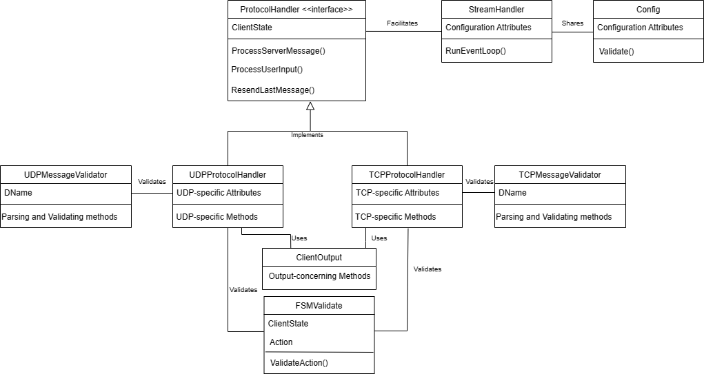
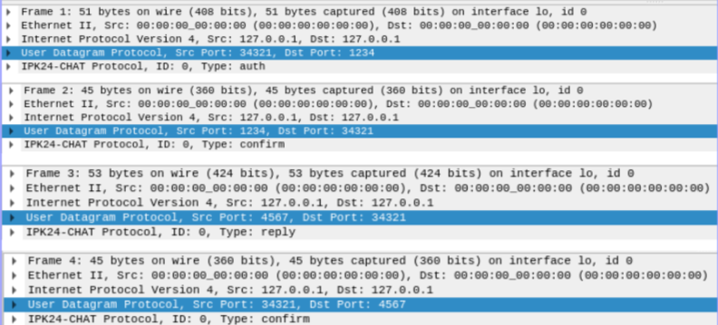

# IPK24 Chat Client


## Table of Contents
1. [General Introduction](#general-introduction)
    1. [Installation and Setup](#installation-and-setup)
    2. [Usage](#usage)
2. [Theoretical Background](#theoretical-background)
    1. [TCP](#tcp)
    2. [UDP](#udp)
3. [System Architecture](#system-architecture)
    1. [Configuration](#configuration)
    2. [Connection](#connection)
    3. [Stream Processing](#stream-processing)
    4. [Protocol Handling](#protocol-handling)
    5. [Message Handling](#error-handling)
    6. [State Machine](#state-machine)
4. [Testing](#testing)
5. [Additional Features](#additional-features)
6. [License](#license)
7. [Bibliography](#bibliography)


## General Introduction
This project is a chat client developed by Marek Effenberger. It is written entirely in C++ (standard C++20), developed for the Linux operating system.
The project is a part of the IPK24 course at the Brno University of Technology. The client is designed to communicate using one of two protocols: TCP or UDP. 
The client can send messages to the server and receive messages from the server. It runs with compliance to the IPK24 protocol which shall be described further.
Most of the approach is based on the Beej's Guide to Network Programming<sup>[1]</sup>.

### Installation and Setup
The client is built using the Makefile. To build the client, run the following command in the root directory of the project:
```bash
make
```
This will create an executable file called `ipk24_chat_client`. To run the client, use the following command with the appropriate arguments described in the table below:
```bash
./ipk24_chat_client -t <tcp|udp> -s <server> [-p <port>] [-d <timeout>] [-r <retransmissions>]
```

| Argument | Value         | Possible Values       | Meaning or Expected Behavior                     |
|----------|---------------|-----------------------|--------------------------------------------------|
| `-t`     | User provided | `tcp` or `udp`        | Transport protocol used for connection          |
| `-s`     | User provided | IP address or hostname| Server IP or hostname                           |
| `-p`     | 4567          | uint16                | Server port                                     |
| `-d`     | 250           | uint16                | UDP confirmation timeout                        |
| `-r`     | 3             | uint8                 | Maximum number of UDP retransmissions           |
| `-h`     |               |                       | Prints program help output and exits            |

The arguments -t and -s are mandatory. The arguments -p, -d, and -r are optional. If the user does not provide these arguments, the client will use the default values.

### Usage
After these initial steps, the client will connect to the server and start the chat. 
The client is expected to enter a message. The user can send the message by pressing the Enter key. 
The client will then wait for a response from the server. If the server sends a message, the client will display it. 
Based on the protocol client can either continue communication or close the connection using the `exit` command or by pressing `Ctrl+C`.

## Theoretical Background

In this section I briefly describe the two protocols used in this 
project: TCP and UDP, their differences, and their use cases within the project.
More detailed information can be found in the RFC 9293<sup>[2]</sup> for TCP and RFC 768<sup>[3]</sup> for UDP.

### TCP


The Transmission Control Protocol (TCP) ensures reliable packet delivery over IP through mechanisms to handle lost, out-of-order, duplicated, or corrupted packets. 
TCP/IP communication begins with a three-way handshake between two computers to establish a connection. 
Data is sent as byte streams, where the only certainties are the order of the bytes and the integrity of the data.
Thanks to the delimiters '\r\n' my client can distinguish between individual messages and process them accordingly.

### UDP

The User Datagram Protocol (UDP) is a connectionless protocol that sends packets of data, called datagrams, over the network.
UDP is faster than TCP because it does not require a connection to be established before sending data and does not guarantee delivery of the data.
The main problem with UDP is that it does not guarantee the order of the packets, nor does it guarantee that the packets will be delivered at all.
To ensure that the packets are delivered, the client sends a confirmation message to the server and vice versa.
Handling of possible duplicates is managed through the use of sequence numbers 'MessageID' which ensures that if the message has been received, it will not be processed again.


## System Architecture

The system is divided into several parts, each of which is responsible for a different aspect of the communication process.
It relies on communication between classes of which the most important one is the 'StreamHandler' class. This class, based on the
protocol used, decides on instantiating a Handler for TCP or UDP. 
The Handler class is responsible for the protocol-specific communication with the server. The Handler class works closely with the 'MessageValidator' class,
which is responsible for validating the messages sent or received. Both TCP and UDP Handler classes communicate with the 'ClientOutput' class, which 
according to the specification prints the messages to the console. Another shared communication is with the 'FSMValidate' class, which is responsible for
validating the state of the client and server. The 'FSMValidate' class is used to ensure that the client and server are in the correct state to send or receive communication-specific messages.

The general overview of the system architecture is shown in the following diagram:



I have deliberately chosen a simple approach which combines procedural and object-oriented programming using only single instances of classes. 
Although the system is not overly complex, the classes are mainly used to encapsulate the basic logic of the system and to separate the concerns of the system.

Through the utilization of smart pointers, the system is designed to be memory-efficient and to avoid memory leaks and segmentation faults.

### Configuration

After the successful parsing of the command-line arguments, this class validates the arguments and sets the configuration of the client.

### Connection

Connection of the client to the server is set in a function 'connectToServer', based on the protocol used, the 'getaddrinfo' function is used to get the server address and port.
If the protocol is UDP the function simply returns the socket, if the protocol is TCP the function establishes a connection using the 'connect' function by iteratively trying the connection
with the structures in the linked-list.

If the protocol is UDP the 'sockaddr_in' structure is used to set the server address and port, 
if the protocol is TCP the 'sockaddr_in' structure is used to set the server address and port and the 'sockaddr_in' 
structure is created and passed for further use.

### Stream Processing

The 'StreamHandler' class is responsible for processing the stream of data received from the server and sending the user's input to the server.
By using the 'poll' function the program can manage the input and output streams and process the data accordingly to the logic of the IPK24 protocol.
Even though 'epoll' is more efficient, I chose to use 'poll' due to its simplicity and also because it allows redirection of the standard input which I could not achieve with 'epoll'.
Based on the StreamHandler's response the 'poll' can block the standard input when it's necessary and allows the client run on single thread.

### Protocol Handling

The 'ProtocolHandler' class is responsible for handling the protocol-specific communication with the server.
It serves as an interface for the 'TCPHandler' and 'UDPHandler' classes, which are responsible for the protocol-specific communication with the server.

The 'TCPHandler' class is responsible for handling the TCP protocol-specific communication with the server.
Utilizing simple logic based on some flags arising from the grammar of the IPK24 protocol, the 'TCPHandler' class sends and receives messages from the server.
The handler decides the further proceedings based on the communication with the 'FSMValidate' class and 'MessageValidator' class.

The 'UDPHandler' class is responsible for handling the UDP protocol-specific communication with the server.
Thanks to the first byte of the message serving as differentiator between the message types, the 'UDPHandler' class can easily distinguish between the messages
and process them accordingly. The 'UDPHandler' class sends and receives messages from the server and decides the further proceedings based on the communication with the 'FSMValidate' class and 'MessageValidator' class.
With each message received the port is updated to the port from which the message was received to comply with the dynamic port assignment of the UDP protocol.


### Message Handling

The 'MessageValidator' class is responsible for validating the messages sent or received. It conforms to the grammar of the IPK24 protocol if concerning the TCP protocol.
If the UDP protocol is used, the 'MessageValidator' parses the messages based on the individual bytes.
The data are passed back to the specific Handler class which decides the further proceedings based on the message type and the communication with the 'FSMValidate' class.

### State Machine

The 'FSMValidate' class is responsible for validating the state of the client and server. 
It ensures that the client and server are in the correct state to send or receive communication-specific messages.
It works with a set of enums representing the Actions and States of the client and server.
The Handler classes based on the reaction of the 'FSMValidate' class decide the further proceedings of the communication.


## Testing

As I have not managed to implement a full-fledged server during the client development, 
the testing of the client was done using the student distributed servers<sup>[4]</sup>, PacketSender<sup>[5]</sup>, Ncat<sup>[6]</sup>, and Wireshark<sup>[7]</sup>.

The client was tested for various scenarios, which shall cover the basic communication between the client and server.

Firstly the arguments were tested for the correct parsing and validation using simple test cases.

The TCP part of the program was tested for the basic communication, with a special focus on the bytestream-specific communication.
The testcases were mainly focused on the overflow of the one 'recv' call of the function. 
This was simply tested by sending a large amount of data
and checking multiple flags and print statements to ensure that the data is processed correctly. 
The data received were observed using inbuilt debugger in the CLion IDE.
The inputs were mostly large ascii art files, sent among students through simple server.

The basic tests were done using Ncat, where the client connected to the local server and sent messages to the server.
The communication could be observed straightforwardly using the Ncat server.

The UDP part was harder to test due to the nature of the protocol. 
Using the PacketSender and the student environment I was able to validate that the dynamic protocol assignment works correctly and that the client can handle the retransmissions of the messages.
This was achieved by confirming the message and switching port on the testing server by simply observing that the address structure changed and the data are sent accordingly.


The packet loss was observed using Wireshark on bigger testcases to ensure that the incrementation of the ID is done correctly.


## Additional Features

The sole feature on top of the requirements is the addition of user-invoked command '/exit' which allows the user to close the connection to the server and exit the client.
This feature was added for simplification of the Ctrl+C command which is not always user-friendly. The interruptSignal thanks to this commands only invokes the exit command and the client can close the connection gracefully.


## License

This code is licensed under the GNU General Public License v3.0. For more information, see the LICENSE file in the root directory of the project.


## Bibliography

1. Beej's Guide to Network Programming, Hall B. [Beej's Guide to Network Programming](https://beej.us/guide/bgnet/)
2. Request for Comments, RFC9293, Wesley E. [RFC 9293 - TCP](https://tools.ietf.org/html/rfc9293)
3. Request for Comments, RFC768, Postel J. [RFC 768 - UDP](https://tools.ietf.org/html/rfc768)
4. Test Server, Hobza Tomáš [Student Distributed Servers](https://git.fit.vutbr.cz/xhobza03/ipk-client-test-server)
5. Packet Sender, Dan Nagle [PacketSender](https://packetsender.com/)
6. Ncat, Lyon Gordon [Ncat](https://nmap.org/ncat/)
7. Wireshark [Wireshark](https://www.wireshark.org/)


[1]: https://beej.us/guide/bgnet/
[2]: https://tools.ietf.org/html/rfc9293
[3]: https://tools.ietf.org/html/rfc768
[4]: https://git.fit.vutbr.cz/xhobza03/ipk-client-test-server
[5]: https://packetsender.com/
[6]: https://nmap.org/ncat/
[7]: https://www.wireshark.org/